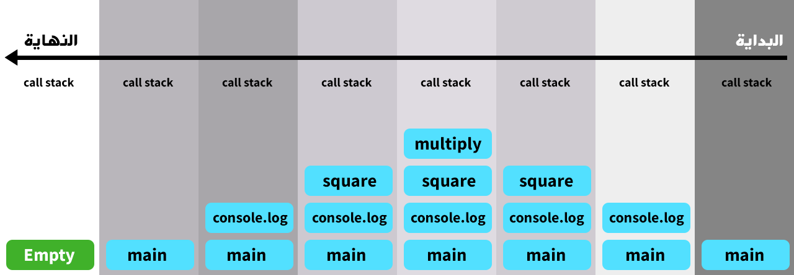
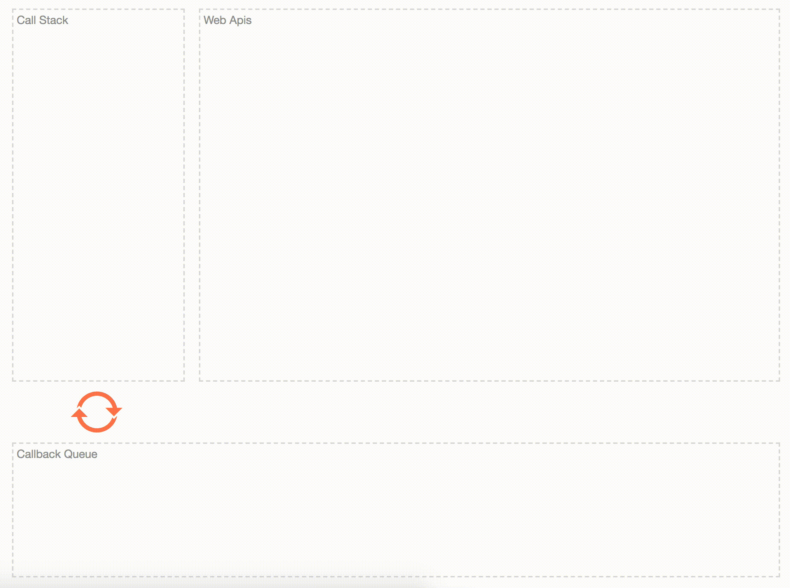

آلية **Event Loop** من أهم قطع الغيار التي تعتمد عليها لغة البرمجة جافا سكريبت والتي تجعل منها لغة قوية وقادرة على القيام بعمليات غير متزامنة على الرغم من طبيعتها كلغة برمجة **أحادية الخيط** أو Single Threaded، والتي تعني أنه لا يمكنها القيام بأكثر من مهمة واحدة في وقت واحد!

فهم كواليس اشتغال أي لغة برمجة يجعل المطور على بصيرة بما يجري في الغرف المظلمة، وبالتالي القدرة على كتابة أكواد برمجية محسنة وأكثر كفاءة في غالب الأحيان.

إذن ما هو Event Loop ؟ وكيف يساعد [جافا سكريبت](/what-is-javascript) في عمليات الإدخال والإخراج الغير متزامنة ؟ هذا ما سنراه ونكتشفه معا في هذه التدوينة الجديدة ضمن سلسلة التدوينات التي نحاول فيها شرح البنية التحتية لجافا سكريبت وأساسياتها التي لا غنى لأي مطور ويب عن فهمها وإدراكها كما يجب.

## لنتعرف أولا على Call Stack

يتوفر كل محرك جافا سكريبت على آلية أو ميكانيزم فريد معروف باسم **Call Stack**، ودوره هو استقبال كل دالة يتم استدعاؤها في كود جافا سكريبت.

بعد تنفيذ أي دالة يتم **حذفها وإزالتها من call stack** للمرور إلى الدالة التي بعدها وهكذا حتى يتم تنفيذ كامل السكريبت ليصبح call stack حينها فارغا في انتظار سكريبت آخر وتكرار نفس العملية بمدخلات جديدة.

لنأخذ الشفرة البرمجية التالية كمثال:

```js
function multiply(a, b) {
  return a * b;
}
function square(n) {
  return multiply(n, n);
}
console.log(square(2));
```

1. في البداية يقوم محرك الجافا سكريبت بإنشاء **إطار عام** يشمل السكريبت كاملا يشار إليه في الغالب ب `main`، فتتم إضافته ل call stack.
2. أول دالة سيصادفها محرك جافا سكريبت في السكريبت هي الدالة الأصيلة `console.log()`، وبالتالي هي أول ما يضاف إلى Call Stack بعد `main()`.
3. بعد ذلك يتم إضافة الدالة `square()` ل call stack كذلك لأننا مررناها كبارامتر ل `console.log()`. هذه الأخيرة بحاجة للقيمة المرجعة من `square()` للقيام بعملها.
4. في داخل `square()` يتم الإستعانة بالدالة `multiply()` لحساب ناتج ضرب عددين. لذلك يتم إضافة هذه الدالة كذلك ل CS وإزالتها بعد ذلك فور أن تُتم عملها بإرجاع القيمة `n*n`.
5. مباشرة بعد ذلك يتم إزالة الدالة `square()` بعد أن يتم حساب تربيع العدد `2` بالإستعانة بالدالة `multiply()` كما بينا في الخطوة السابقة.
6. في الأخير بعد أن يتم تنفيذ كامل السكريبت يتبقى فقط الإطار العام `main()`، لذلك يتم إزالته هو الآخر من أجل تنقية Call Stack وبالتالي تحسين وإفراغ ذاكرة المتصفح.

**ما يجب معرفته وتذكره هنا أن كل دالة يتم استدعاؤها في السكريبت تضاف إلى Call Stack وتحذف منه بعد ذلك فور إتمامها لعملها للمرور إلى الدالة التي تليها حتى يتم تنفيذ كامل البرنامج.**

الصورة التالية تلخص كل ماسبق:



## ولكن ؟!

قلنا فيما سبق بأن جافا سكريبت لغة برمجة **Single Threaded** وبالتالي فإن Call Stack **لا يستطيع القيام سوى بمهمة واحدة في ذات الوقت**.

هذا يجعلنا نطرح سؤالا مهما للغاية.. ماذا لو كانت العملية أو الدالة التي نريد تنفيذها في حاجة إلى البعض الوقت (ثواني) لإتمام مهمتها ؟ هل سيتوقف Call Stack طيلة تلك المدة الزمنية من أجل المرور إلى المهمة التالية ؟

بالطبع لا! لأن هذا أمر سيكون كارثيا لو كان واقعا فعلا 😜

لحسن الحظ جافا سكريبت يعرف جيدا كيف يقوم بمثل تلك **العمليات الغير متزامنة** بفعالية كبيرة وقدر عالي من الكفاءة، وفضل كبير في ذلك يرجع لموضوعنا الرئيسي اليوم وهو **Event Loop**.

كيف ذلك ؟ هذا ما سنكتشفه معا بعد لحظات.

لنتابع 😃

## كيف يعمل Event Loop ؟

يوفر المتصفح ـ بالإضافة إلى ما هو موجود أصلا في **JavaScript Engine** ـ واجهات برمجية خاصة لزيادة إمكانيات بيئة التشغيل وجعلها أكثر تميزا. مجموع تلك الواجهات البرمجية يشار إليها ب Web API ومنها واجهة DOM API الأكثر استخداما من مطوري الويب، وأيضا واجهة `xhr` ومعها `fetch` اللتان تمكان المطورين من القيام بطلبات `http` من داخل جافا سكريبت.

تمكن واجهات Web API من القيام بمختلف العمليات التي قد تكون **غير متزامنة** والتي يستخدم فيها المتصفح إمكانياته المتطورة لجعلها متناغمة وتتم بالتوازي مع العمليات المتزامنة التي تُنفذ بسرعة واحدة تلو الأخرى.

يلعب Event Loop دور **حلقة الربط** بين Web API و Call Stack، ولكي نفهم جيدا المقصود من هذا الكلام سنأخذ هذا المثال الجديد الذي سنستعمل فيه الدالة `setTimeout()` التي هي جزء من Web API الخاص بالمتصفح.

```js{2}
console.log('Hello');
setTimeout(() => console.log('Thank you Event Loop!'), 2000);
console.log('World');
```

هذه الدالة تقبل بارامترين اثنين وكما هو معلوم تمكننا من تنفيذ مهام معينة (البارامتر الأول) بعد مرور مدة زمنية محددة بالبارامتر الثاني.

يبدأ محرك جافا سكريبت بتنفيذ الدالة `console.log('Hello')` في السطر الأول بالإعتماد على Call Stack كما شرحنا في السابق. ولكن المشكل الصغير موجود في السطر الثاني حيث دالة `setTimeout()` الغير متزامنة والتي تمكننا من **تأجيل** تنفيذ مهمة معينة لمدة زمنية معينةzمحددة (ثانيتين في مثالنا)، وكما قلنا آنفا لا يمكننا الإنتظار طيلة تلك المدة للمرور إلى الدالة أو العملية الموالية.

ما سيحدث هو أن الدالة `setTimeout()` سيتم إرسالها بشكل عادي إلى Call Stack، وهذا الأخير سيفهم سريعا بأنها دالة غير متزامنة وبالتالي يأخذ الدالة المرجعة منها `() => console.log('Thank you Event Loop!')` ويقوم بإسنادها إلى Web API حيث يتم حساب المدة الزمنية `2000ms` حتى يقوم بإعادة إرسالها، ليس إلى Call Stack مباشرة، ولكن إلى ما يشبه قاعة انتظار وتعرف باسم الذيل أو **Queue**.

مباشرة بعد إسناد `setTimeout` إلى Web API يتم المرور مباشرة إلى الدالة `console.log('World')` في السطر الثالث بغض النظر عما آلت إليه الأوضاع في العملية الغير متزامنة بالسطر الثاني.

يعني في الوقت الذي يتم فيه حساب مدة الثانيتين `2000ms` يكون السطر الثالث من السكريبت قد تم تنفيذه بالفعل. بعدها يصبح Call Stack فارغا بعد أن قام بإتمام كل العمل الموكل إليه لحد الساعة.

هنا يبدأ تدخل Event Loop في اللعبة والقيام بعمله الذي الذي يتمثل ببساطة في **ربط قاعدة الإنتظار (Queue) ب Call Stack**.

عندما يفرغ Call Stack يقوم Event Loop بالنظر في Callback Queue لرؤية ما إذا كانت هناك بعض المهام التي تنتظر دورها ويأخذ أول مهمة ويعطيها ل Call Stack من أجل تنفيذ ما بها من أوامر، وهكذا حتى ننتهي من جميع المهام الموجودة في ذلك Queue.

وهذه الصورة المتحركة تلخص ما جرى في مثالنا ولعلها تكون أفصح من كل ما كتبناه لوصف ما حدث 😉



```terminal
Hello
World
Thank you Event Loop!
```

أحب أن أشير هنا إلى أنه حتى ولو قمنا بتمرير `0` كمدة زمنية إلى الدالة `setTimeout` فإنها ستكون **آخر ما يتم تنفيذه**! لأنها مجبرة على المرور من مرحلة ال Queue وبالتالي عليها الإنتظار حتى يفرغ Call Stack بالكامل من المهام الأخرى التزامنية من أجل إعطائها فرصة من طرف Event Loop 🔄

لكي تتأكدوا من هذا الكلام قوموا بتجربة الكود بأنفسكم 👍

## في الختام

هذا بنظري وخبرتي أهم ما يجب أن يقال حول **Call Stack** و **Event Loop**. لا تقلق إذا وجدت الموضوع معقدا إلى حد ما، المهم أنك الآن كونت فكرة أولية عما يحدث في كواليس جافا سكريبت ولماذا هذه اللغة بارعة في التعامل مع العمليات الغير متزامنة Asynchronous I/O أو Non-blocking I/O.

بيئتي التشغيل [Node.js](/web-development/javascript/what-is-nodejs) و كذلك [Deno](/what-is-deno) يعتمدان كذلك على ميزة Event Loop للقيام بتلك العمليات وإدارة مختلف أنواع الأحداث (Events). كل منهما نفذ ذلك بطريقته الخاصة ولكن فكرة Event Loop تبقى واحدة في جميع بيئات تشغيل جافا سكريبت المختلفة.

وإذا كنت من عشاق المواد التعليمية السمعية البصرية فهذا [فيليب روبرتس](https://twitter.com/philip_roberts) في الفيديو أسفله يشرح موضوع Event Loop بطريقته الخاصة والفريدة. آمل أن يكون مفيدا ومكملا لكل ما قيل في هذه التدوينة.

<iframe style="max-width: 100%;margin: 0 auto; padding: 1rem 0 2rem; display: block;     box-sizing: content-box;" width="560" height="315" src="https://www.youtube.com/embed/8aGhZQkoFbQ?controls=0" frameborder="0" allow="accelerometer; autoplay; encrypted-media; gyroscope; picture-in-picture" allowfullscreen></iframe>

لا تنسى كذلك الإطلاع على المراجع الواردة أسفل المقال للمزيد من التفاصيل والمعلومات.

---

#### مراجع مهمة

- [JavaScript Visualized: Event Loop](https://dev.to/lydiahallie/javascript-visualized-event-loop-3dif)
- [Understanding the JavaScript call stack](https://www.freecodecamp.org/news/understanding-the-javascript-call-stack-861e41ae61d4/)
- [JavaScript Call Stack](https://www.javascripttutorial.net/javascript-call-stack/)

<Author slug="aissa" />
