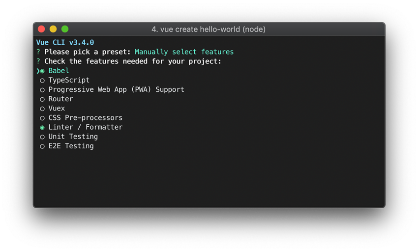

عند الحديث عن **Vue.js** فإننا في حضرة واحد من أكثر [ثلاثة أطر عمل جافا سكريبت](/web-development/javascript/react-vue-angular-comparison) استعمالا على مستوى العالم، إلى جانب كل من رياكت وأنجولار.

Vue يمكن اعتباره **مكتبة لبناء واجهات المستخدم** مثل رياكت، ويمكن اعتباره كذلك إطار عمل جافاسكريبت متكامل إذا أضيفت إليه مجموعة من الأدوات الأخرى والتقنيات التي تدور في فلكه والمدعوم جزء كبير منها من فريق VueJs نفسه.

نستطيع إضافة Vue.js لأي مشروع وفي أي مرحلة، ولذلك السبب تم تعريفه على أنه **إطار عمل تقدمي** أو **Progressive Framework**، حتى أنه يمكن أن يلعب دور مكتبة مثل [jQuery](/web-development/javascript/جافاسكريبت-وجيكويري-؟-أية-علاقة-؟) في كثير من الحالات وبفعالية ممتازة.

تطرقنا في هذه المدونة إلى العديد من [المواضيع المتعلقة بإطار العمل Vue](/tags/vuejs/) ولكننا لم نخصص له بعد مقدمة تصلح أن تكون مدخلا لمن يريد اكتشاف ماهيته أو البدء في تعلمه. لهذا قررت أن يكون هذا الدرس بمثابة نظرة أولية عنه، مع تبيان أبرز المزايا التي يوفرها لمطوري الواجهات الأمامية.

## البداية

يمكننا أن نبدأ في استخدام Vue.js بطريقتين مختلفتين:

- عن طريق شبكة توصيل المحتوى أو CDN (الطريقة التقليدية).
- عن طريق حزمة Vue CLI.

الطريقة الأولى بسيطة جدا، وهي بإضافة سكريبت المكتبة إلى الصفحات حيث نحتاجها كما يلي:

```html
<script src="https://cdn.jsdelivr.net/npm/vue"></script>
```

أما الطريقة الثانية فهي كما قلت باستعمال الحزمة Vue CLI والتي تعادل حزمة Creat-React-App في بيئة React.

لن نتطرق الآن ل Vue CLI، سندعها لنهاية المقال ونخصص لها القليل من الكلام. ما يهمنا الآن هو اكتشاف أهم مزايا مكتبة Vue.js ولماذا حظيت بشعبية ممتازة بين المطورين.

ومن المفروض عليك كمبتدئ أن تتجنب بدء رحلتك مع Vue باستخدام Vue CLI، لأن هذا من شأنه أن يضيف طبقة أخرى من التعقيد على الأمور وأنت في غنى عن ذلك لأنك تريد **التركيز على Vue.js فقط** 😉

## مميزات مكتبة Vue.js

يتمتع إطار العمل Vue.js بعدد من المزايا التي جعلت منه محبوبا لدى مطوري جافا سكريبت. استطاع إيفان يو وفريقه توفير كل تلك المميزات وفي نفس الوقت ضمان سهولة الإستخدام مما نتج عنه **تجربة مطور** (DX = Developer Experience) ممتازة بشهادة الجميع كما أسلفت.

### 1. قوالب HTML ديناميكية

يوفر VueJs طريقة **تصريحية وسهلة القراءة** لعرض المشاهد (Views) وذلك بالإعتماد على قوالب HTML **منكهة** بالجافا سكريبت. هذه يذكرنا بالإصدار الأول من** أنجولار** الذي كان يتبع نفس الطريقة.

```html
<div id="root">{{ message }}</div>
```

```js
var app = new Vue({
  el: '#app',
  data: {
    message: 'Hello World!'
  }
});
```

```terminal
Hello World!
```

في هذا المثال البسيط تبدو الأمور وكأن Vue.js مجرد محرك قوالب مثل Mustache أو Handlebars، ولكن خلف الكواليس هناك عمل كبير لربط شجرة DOM (العناصر في نطاق `#root` بصفحة الويب) بالبيانات الموجودة في الكائن `app` أو نسخة من الكلاس `Vue` الذي قمنا بإنشائه.

في المحصلة يكون لدينا **نظام متفاعل** (**Reactive**) بحيث أن كل تغيير على هذا الجانب (جافا سكريبت أو DOM) يصاحبه بشكل تلقائي تغيير على الجانب الآخر.

#### الخصائص (Attributes)

يمكننا كذلك ربط بيانات Vue **بخصائص عناصر HTML** عن طريق استخدام اسم الخاصية مسبوقة ب `v-bind:`.

```html
<div id="root">
  <span v-bind:title="title">{{ message }}</span>
</div>
```

```js
var app = new Vue({
  el: '#root',
  data: {
    message: 'Hello World!',
    title: 'This is a title.'
  }
});
```

هكذا قلنا لمكتبة Vue.js بأن تبقى قيمة خاصية العنوان `title` هي نفسها القيمة `title` في بيانات نسختنا من `Vue` والمضمنة في الكائن `data` كما هو واضح.

الخاصية `v-bind` تعرف باسم **Directive**، وهناك العديد من Directives في Vue.js. دورها هو التحكم في شجرة DOM وإجراء تحديثات وتغييرات عليها بحسب تغير قيمة التعبير المسند إلى Directive.

يمكن اختصار `v-bind:` باستعمال النقطتين العموديتين فقط `:` 😉

```html
<span v-bind:title="title">Hello world</span>
// هو نفسه
<span :title="title">Hello world</span>
```

أما بالنسبة للأحداث (Events) فنستخدم فيها `v-on` بهذه الطريقة:

```html
<button v-on:click="doSomething">Click me</button>
```

وكما هو الحال بالنسبة ل `v-bind:` فإنه يمكن كذلك اختصار `v-on:` ولكن هذه المرة باستعمال الرمز `@` 😉

```html
<button @click="doSomething">Click me</button>
```

### 2. الشروط والحلقات

إلى جانب `v-bind` و `v-on`، هناك Directives أخرى تمكننا من **التحكم في بنية وهيكل شجرة DOM**.

#### الشروط

على سبيل المثال يمكننا الإستعانة ب `v-if` لعرض أو إزالة مقطع من HTML **بحسب تحقق شرط** معين. وإذا كنت مستخدما قديما لإطار العمل AngularJs 1.x فحتما تتذكر الآن `ng-if` التي تقدم نفس الخدمة.

```html{2}
<div id="root">
  <span v-if="loading">Loading...</span>
</div>
```

```js{4}
var app = new Vue({
  el: '#root',
  data: {
    loading: false
  }
});
```

يمكن كذلك استخدام `v-show` لنفس الغرض، الفرق أن `v-show` تقوم بإخفاء وإظهار العنصر باستعمال Css فقط، بينما `v-if` تقوم بذلك العمل عن طريق إزالة العنصر نهائيا من `DOM` وإعادة تركيبه فور تحقق الشرط.

#### الحلقات

من Directives التي تستخدم كذلك بكثافة في تطبيقات Vue.js نجد `v-for`.

كما هو واضح من الإسم فإنها تمكننا من **عمل حلقة تكرارية** لعرض محتوى المصفوفة في HTML.

الطريقة سهلة وحدسية ولا تحتاج منا أي عناء:

```html{3}
<div id="root">
  <ul>
    <li v-for="user in users">
      {{ user.name }}
    </li>
  </ul>
</div>
```

```js{4-8}
var app = new Vue({
  el: '#root',
  data: {
    users: [
      { name: 'Abdullah Ahmed' },
      { name: 'Mohamed Ismail' },
      { name: 'Aymen Saleh' }
    ]
  }
});
```

```terminal
• Abdullah Ahmed
• Mohamed Ismail
• Aymen Saleh
```

إلى جانب كل ذلك، توفر Vue.js مجموعة من **Transition Effects** لإضفاء لمسات جمالية عند إضافة أو حذف عنصر من واجهة المستخدم. مثلا تطبيق تأثير `fade` على العنصر عوض ظهوره أو إختفاءه بشكل مفاجئ وسريع من الصفحة.

- المزيد من التفاصيل حول هذه الجزئية [تجدها في هذه الصفحة](https://vuejs.org/v2/guide/transitions.html).

### 3. التعامل مع مدخلات المستخدم

يتيح لنا جافاسكريبت إمكانية التعامل مع المستخدم عن طريق إطلاق الأحداث أو Events، ومكتبة VueJs توفر واجهة برمجية رائعة للإستعانة بالأحداث وربطها ببيانات الحالة الخاصة بنسختنا من كلاس `Vue`.

```html
<div id="root">
  <p>{{count}}</p>
  <button v-on:click="increment">+</button>
</div>
```

```js
var app = new Vue({
  el: '#root',
  data: {
    count: 0
  },
  methods: {
    increment() {
      this.count = this.count + 1;
    }
  }
});
```

بالإضافة إلى الخاصيتين `el` و `data` اللتين يتوفر عليهما الكائن الذين نقوم بتمريره إلى نسختنا من `Vue`، هناك خاصية ثالثة أيضا مهمة اسمها `methods` وبداخلها نقوم بتعيين كافة الوظائف أو الدوال التي نريد **تنفيذها عند وقوع حدث معين**.

في المثال أعلاه صرحنا بالوظيفة `increment()` التي تنفذ عند النقر على الزر `button` كما هو واضح من القالب.

الكائن `this` في الوظائف الموجودة بداخل `methods` يتم ربطه **تلقائيا** بالكائن `app` المستنسخ من الكلاس `Vue`. لذلك أمكننا الوصول إلى العداد `this.count` من دون عمل أي Binding بشكل يدوي، والذين جربوا مكتبة React.js سيعرفون أكثر من غيرهما عن ماذا أتحدث هنا 😃

يجب التأكيد هنا إلى ضرورة **تجنب التعديل المباشر على DOM**! هذا من اختصاصات مكتبة Vue.js. كل ما هو مطلوب منك هو تحديث حالة التطبيق (App State) وVue.js سيتولى تحديث DOM بعد ذلك وإجراء التغييرات المناسبة عليه بأفضل وأكفء السبل الممكنة.

بالإضافة إلى الأحداث، يمكننا كذلك عمل ربط بين مدخلات المستخدم في الحقول النصية عبر Directive غاية في الأهمية وهو `v-model`.

```html
<div id="root">
  <p>{{message}}</p>
  <input v-model="message" />
</div>
```

```js
var app = new Vue({
  el: '#root',
  data: {
    message: 'Hello World!'
  }
});
```

يمَكِّن `v-model` من إدارة تدفع البيانات المدخلة في الحقول النصية **في الإتجاهين**، فكل تغيير في محتوى العنصر `input` يقابله تغير في قيمة الحالة `message` والعكس صحيح أيضا، يتغير محتوى الحقل `input` أوتوماتيكيا بمجرد تغيير قيمة `message` برمجيا.

هذا ما يعرف في Vue.js ب **Two-way Data Binding**.

- [الفرق بين Two-way data binding و One-way data binding في جافاسكريبت](/web-development/javascript/one-way-vs-two-way-data-binding)

### 4. دعم فكرة المكونات

انتشر مفهوم أو نظام المكونات بشكل كبير في ميدان صناعة الويب في العقد الأخير مع بروز مكتبة React.js وفكرة [مكونات الويب](/web-components) التي يجري العمل على قدم وساق لدمجها ودعمها على أوسع نطاق من مختلف المتصفحات.

تكمن أهمية المكونات أو Components في إمكانيات تقسيم واجهات المستخدم (UI) إلى وحدات صغيرة مستقلة وقائمة بذاتها معروفة باسم المكونات. كل مكون قادر على **إدارة حالته الخاصة** مع إمكانية تلقي معلومات من الخارج بفضل ما يعرف **بالخصائص أو Properties**، ويشار إليها اختصارا ب **Props**.

المكون في Vue.js هو مجرد نسخة أخرى من الكلاس `Vue`، ويقبل تقريبا نفس الخصائص التي رأيناها أعلاه مع `new Vue` باستثناء `el`.

يمكن إنشاء مكون Vue بطريقة بسيطة:

```js
Vue.component('todo-item', {
  template: '<li>This is a todo</li>'
})

var app = new Vue(...);
```

بعدها يمكننا استعمال هذا المكون في القالب بالطريقة الإعتيادية التي نستعمل بها أي عنصر HTML.

```html
<ul>
  <todo-item></todo-item>
</ul>
```

لجعل المحتوى النصي للمكون `todo-item` ديناميكيا سيكون علينا الإستعانة بميزة **الخاصية**. سيكون لمكوننا خاصية (Prop) اسمها على سبيل المثال `toto` وتمثل الكائن الذي يحتوى على معلومات Todo المستخرجة غالبا من قاعدة البيانات.

```js
Vue.component('todo-item', {
  props: ['todo'], // هنا يتم تمرير الخصائص التي يقبلها المكون
  template: '<li>{{ todo.text }}</li>' // محتوى ديناميكي
});

var app = new Vue({
  el: '#root',
  data: {
    todos: [
      { id: 0, text: 'Learn Vue.js' },
      { id: 1, text: 'Learn Vuex' },
      { id: 2, text: 'Learn Laravel' }
    ]
  }
});
```

```html
<div id="root">
  <ul>
    <todo-item
      v-for="todo in todos"
      v-bind:todo="todo"
      v-bind:key="todo.id"
    ></todo-item>
  </ul>
</div>
```

```terminal
• Learn Vue.js
• Learn Vuex
• Learn Laravel
```

لاحظ أننا استعملنا في قالب HTML نفس Directives التي اكتشفناها سابقا مثل `v-for` و `v-bind`.

وكما هو واضح ينصح دائما وبشدة باستعمال الخاصية `v-bind:key` عند عرض مكون عدة مرات انطلاقا من مصفوفة وذلك لمساعدة مكتبة Vue.js في عملية Rendering وتحديد التغييرات التي يجب عليها إجراؤها على DOM.

- [شرح أهمية key property في React.js](/react-key-prop)

#### نقطة مهمة

إلى حدود الساعة، الخاصية `data` هي عبارة عن كائن جافاسكريبت (Litteral Object) والأمور سارت على ما يرام في كل الأمثلة التي رأيناها.

```js
data: {
    count: 0,
    message: 'This is a message',
    etc: '...'
}
```

لم نصادف أي مشكل لأننا لحد الآن جربنا نسخة واحدة من مكوننا في الصفحة. ولكن ماذا لو تم استخدام المكون في أكثر من موضع بالصفحة ؟

لنتخيل معا تطبيق العداد الذي رأيناه منذ قليل، لو كان ذلك العداد مكوِّناً وعرضناه في أكثر من مكان فإننا عندما ننقر على زر لأي نسخة لزيادة قيمتها فإن ذلك سيؤثر على باقي نسخ ذلك المكون المعروضة في تلك الصفحة ويغيرر قيمها، والسبب أنهم جميعا يتشاركون نفس الكائن `data`، وبالتالي كلما غيَّر أحدهم قيمة من القيم الموجودة داخل ذلك الكائن انعكس ذلك بشكل مباشر على باقي النسخ وذلك خطأ جسيم بطبيعة الحال لأن الأصل أن كل مكون هو **مستقل بذاته** وقابل **لإعادة الإستخدام** في مواضع مختلفة.

**الحل هو أن نجعل `data` عبارة عن دالة `function` تقوم بإرجاع الكائن الذي يحتوي على البيانات الداخلية للمكون**. هذا سيضمن لنا أن يتم إرجاع **كائن جديد** في كل مرة ننشئ فيها نسخة جديدة من ذلك المكون.

```js
data: function() {
    return {
        count: 0,
        message: 'This is a message',
        etc: '...'
    }
}
```

إذن عندما نبني مكونا قابلا لإعادة الإستخدام والعرض عدة مرات فمن الضروري استعمال `data` على شكل دالة، وإلا فلا بأس في استعماله ككائن جافا سكريبت اعتيادي إذا كان المكون يظهر دائما مرة واحدة مثل ترويسة الموقع، الشريط الجانبي وغيرها من الأجزاء التي لا يوجد منها إلا نسخة واحدة فقط.

#### وظائف دورة الحياة في Vue.js

تمر كل نسخة من `Vue` في مراحل متعددة منذ إنشائها وحتى إزالتها من واجهة المستخدم. على سبيل الذكر:

- مرحلة ترجمة القالب.
- مرحلة تركيب (Mount) نسخة `Vue` في DOM.
- مرحلة تحديث DOM عند تغير بيانات المكون أو نسخة `Vue` (في النهاية كل مكون هو عبارة عن نسخة من الكلاس `Vue`).
- مرحلة الإزالة والحذف (Destroying).
- ...

في كل مرحلة من تلك المراحل الكثيرة تقوم مكتبة Vue.js بإطلاق مجموعة من الوظائف، أو ما يعرف في Vue.js بِ **Lifecycle Hooks**، لتمكين المستخدم من القيام بمهام معينة (مثلا Data fetching) في نقطة زمنية محددة من حياة المكون.

من أهم Lifecycle hooks التي تستخدم بكثرة في تطبيقات Vue نجد ما يلي:

- `created`: يتم تنفيذ هذه الوظيفة بعد إعداد النسخة بشكل كامل وكل ما يتعلق بها من بيانات، خصائص، وظائف وأحداث، **ولكن لم يتم تركيبها بعد في DOM**. وهنا المكان الأفضل الذي يتم فيه عمل Data fetching.

- `mounted`: هذه الوظيفة يتم إطلاقها **بعد الإنتهاء من تركيب نسخة `Vue` في شجرة DOM**، لذلك يعد هنا المكان الأمثل للقيام ببعض العمليات التي نحتاج فيها للوصول إلى DOM (مثلا استعمال مكتبات طرف ثالث). تستخدم هذه الوظيفة كذلك لعمل Data fetching ولكن استعمال `created()` أحسن كما قلنا أعلاه.

- `updated`: تنفذ هذه الوظيفة بعد تحديث لبيانات المكون مما ينتج عنه تحيين المكون وإجراء تغيير على مستوى DOM.

- `destroyed`: تظهر هذه الوظيفة بعد أن تتم إزالة المكون من واجهة المستخدم، حينها قد تم التخلص من كل ما يخصه من أحداث مرتبطة به وكذلك أبنائه.

```js
var app = new Vue({
  data: {
    message: 'This is a message'
  },
  created() {
    console.log('Created!');
  },
  mounted() {
    console.log('Mounted!');
  },
  updated() {
    console.log('Updated!');
  },
  destroyed() {
    console.log('Destroyed!');
  }
});
```

تجدر الإشارة إلى أن الكائن `this` في جميع وظائف دورة الحياة في Vue.js مرتبط ويشير إلى تلك النسخة من `Vue`. هذا يعني أنه يمكنك الوصول إلى كل ما يخصها من بيانات (data) ووظائف (methods).

```js{10-13}
var app = new Vue({
  data: {
    message: 'This is a message'
  },
  methods: {
    sayHello() {
      return 'Hello!';
    }
  },
  created: function() {
    console.log(this.message); // This is a message
    console.log(this.sayHello()); // Hello!
  }
});
```

هذا الكلام يعني أنه **من غير المقبول استخدام الدوال السهمية ([Arrow functions](/'web-development/javascript/arrow-functions-javascript)) في وظائف دورة الحياة**، لأن تلك الدوال السهمية تؤشر على النطاق الأب (Parent context وقد يكون هو `window` في حالات كثيرة)، وبالتالي فإن `this` لا يعني بالضرورة نسخة `Vue` كما هو متوقع وبالتالي الوظيفة `this.sayHello()` في المثال أعلاه ستعتبر `undefined`.

```js{10-13}
var app = new Vue({
  data: {
    message: 'This is a message'
  },
  methods: {
    sayHello() {
      return 'Hello!';
    }
  },
  created: () => {
    console.log(this.message); // undefined
    console.log(this.sayHello()); // undefined
  }
});
```

> هناك وظائف أخرى بالإضافة لما ذكرته هنا، للإطلاع عليها كاملة أحيلك على [هذه الصفحة من توثيق Vue.js](https://vuejs.org/v2/api/#Options-Lifecycle-Hooks).

## Vue CLI

سفي مراحل متقدمة من Vue.js وخصوصا إذا أردنا بناء [تطبيق ويب أحادي الصفحة](/web-development/javascript/what-is-single-page-application) أو [تطبيق ويب تقدمي](/web-development/what-is-progressive-web-applications) فإن الإستعانة ب **Vue CLI** يصبح أمرا ضروريا وينصح به بشدة، لا سيما وإن هذه الحزمة صممت بعناية لتوفير أكبر قدر ممكن من الأدوات والمميزات لمساعدة المطورين على بناء تطبيقات ويب عصرية وتوفير الوقت اللازم للقيام بعدد من الإعدادات الضرورية.

### أهم مميزات Vue CLI

- ميزة المكونات أحادية الملف أو [Single File Components](https://vuejs.org/v2/guide/single-file-components.html).
- دعم [Webpack](/web-development/javascript/what-is-webpack) والإستفادة من المميزات الإستثنائية التي يوفرها فيما يتعلق بتحزيم الملفات والأصول الثابتة (Static assets).
- دعم أشهر [معالجات CSS](/web-development/html-css/why-you-should-use-css-preprocessors-in-your-projects) مثل Less ،Stylus ،Sass و PostCSS.
- دعم وسهولة دمج [تايب سكريبت](/what-is-typescript).
- دعم [الإختبارات البرمجية](/web-development/ما-هي-الإختبارات-البرمجية) (Unit Testing و e2e Testing).
- دعم تطبيقات الويب التقدمية (PWA).
- إمكانية إضافة مميزات جديدة بفضل نظام الإضافات (Plugins).
- توفير واجهة مستخدم رسومية إذا كنت تفضلها على نافذة الأوامر السطرية 😃
- والمزيد...

ميزة **Single File Components** التي ذكرناها أولا هي ما سنهتم به في هذا الدرس، فهي أول ميزة ستثير انتباهك عندما تبدأ في استخدام حزمة Vue CLI.

### ميزة المكونات أحادية الملف

تمكننا Vue CLI من خلال هذه الميزة من جمع كل ما يتعلق بالمكون في ملف واحد امتداده `.vue`. وعندما نقول كل شيء فإننا نتحدث عن:

- جافا سكريبت
- HTML
- CSS


في منطقة `<template>` نضع القالب الخاص بالمكون ويمكننا استخدام HTML مباشرة أو أي **محرك قوالب HMTL** نرغب به، مثل Pug على سبيل الذكر.

نفس الكلام يقال عن `<style>`، حيث يمكننا استخدام CSS العادي أو أي كود قابل للترجمة إلى CSS مثل أكواد **Sass** و**PostCSS**.

الجميل كذلك مع هذه الميزة أن جميع متغيرات الجافاسكريبت وكذلك محددات CSS هي **محمية داخل نطاق ذلك المكون** ولا يمكن أن تتعارض أو تتداخل مع نظيراتها في المكونات الأخرى، وهو المشكل الذي لم يكن ممكنا تفاديه بسهولة مع استخدام Vue.js بطريقة CDN التي رأيناها أولا.

### البداية مع Vue CLI

للبدء باستخدام Vue CLI يجب علينا تثبيت الحزمة `@vue/cli` في جهازنا بهذه الطريقة:

```bash
npm install -g @vue/cli
```

بعد نجاح التثبيت، سيمكننا الوصول إلى `vue` من خلال نافذة الأوامر السطرية:

```bash
vue --version
```

نستطيع إنشاء مشروع جديد من خلال الأمر `vue create` مع إضافة اسم المشروع:

```bash
vue create hello-world
```

بعد تنفيذ هذا الأمر سيتم سؤالك عن بعض الإعدادات. مثلا:

- هل تريد إضافة تايب سكريبت ؟
- هل تحتاج ل **Vue Router**.
- هل تريد دعم ميزة PWA.
- إلخ...



يمكنك تجاوز تلك الأسئلة والإكتفاء بالإعدادات الإفتراضية ل Vue CLI.

بعد هذا سيتم توليد المشروع بنجاح، ومن ضمن الملفات المولدة سيكون هناك ملف اسمه `.vue` - على الأغلب اسمه `App.vue` - ويمثل مكون Vue.js الإفتراضي للمشروع.

يمكن إطلاق المشروع في الخادم المحلي عن طريق `vue serve`، أما عملية بناء المشروع وتصديره فتتم عبر `vue build`.

وكما ذكر آنفا، يمكن الإستعانة بالواجهة الرسومية للقيام بكل ما ذكر بالنقر على الأزرار عوض كتابة الأوامر 😅

```bash
vue ui
```

هذا ـ باختصار ـ أهم ما يمكن قوله عن حزمة Vue CLI. للمزيد من التفاصيل أنصحكم [بالتوثيق الوسمي](https://cli.vuejs.org/).

## في الختام

لا يمكن المرور على جميع المزايا الرائعة لمكتبة **Vue.js** في مقال أو تدوينة واحدة، إنما غرضي اليوم هو أن أفتح عينيك على بعض من جمالية هذه المكتبة وما يمكن أن توفره لك كمطور ويب متخصص في الواجهات الأمامية.

[أمضى إيفان يو واستثمر الكثير من الوقت](/web-development/javascript/vuejs-framework-launching-story/) لصناعة مكتبة UI لمنافسة [React.js](/web-development/javascript/react-javascript-library) وفق رؤية وفلسلفة خاصة. وأظنه نجح في ذلك إلى حد بعيد كون Vue.js تحظى باحترام وحب أغلب المطورين حتى من مستعملي المكتبات وأطر العمل المنافسة. كل هذا والمكتبة ليست مدعومة لا من فيسبوك ولا من جوجل مثلما هو الحال بالنسبة لرياكت و[أنجولار](/tags/angular/).

Vue.js مكتبة رائعة وبكل تأكيد ستزداد شعبيتها في قادم الأيام، لا سيما وأن الجميع يترقبون وصول إصدار Vue 3 ومعه الكثير من المميزات الجديدة.

<iframe style="max-width: 100%;margin: 0 auto; padding: 1rem 0 2rem; display: block; box-sizing: content-box;" width="560" height="315" src="https://www.youtube.com/embed/OrxmtDw4pVI?controls=0" frameborder="0" allow="accelerometer; autoplay; encrypted-media; gyroscope; picture-in-picture" allowfullscreen></iframe>

<Author slug="aissa" />
