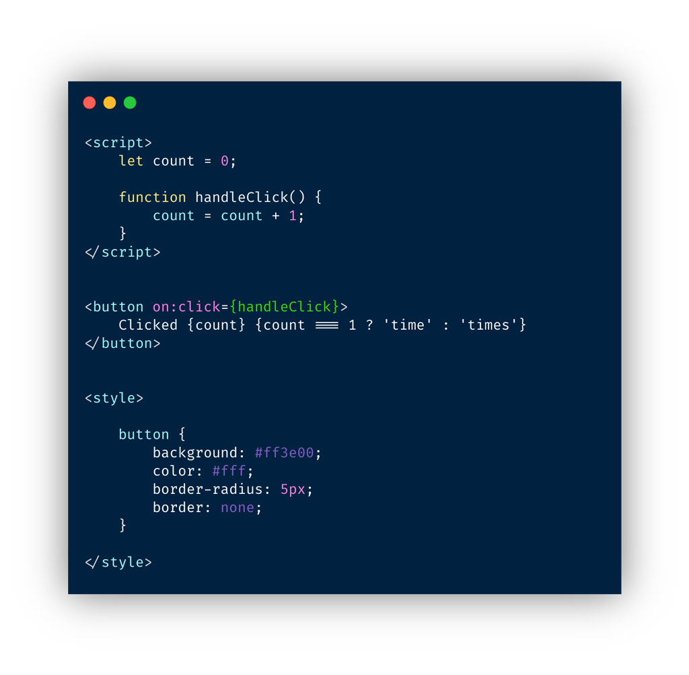

يعتبر **Svelte** من أحدث التقنيات التي ظهرت بغرض مساعدة المطورين على بناء واجهات المستخدم لتطبيقات الويب، ليدخل بذلك المعركة المحتدمة أصلا بين الثلاثة الكبار **Vue.js، رياكت وأنجولار** في سبيل الإستحواذ على أكبر قدر ممكن من الكعكة.

بقراءة بعض المقالات وآراء مطوري الويب حول Svelte يتضح بأن الأخير استطاع فعلا أن يترك انطباعا جيدا لديهم، بل وكسب وِدَّ عدد لا بأس به منهم خصوصا مع الإصدار الأخير الذي حمل الرقم 3.

في هذه التدوينة سنكتشف معا الأسباب الحقيقية وراء النجاح الذي حققه **Svelte 3** على الرغم من كونه ليس مدعوما من طرف أي شركة أو منظمة كبيرة. سنحاول كذلك المرور على أبرز معالمه والمميزات التي جعلته فعلا فريدا من نوعه ومختلفا عما سبقه من تقنيات منافسة.

## لماذا Svelte فريد من نوعه ؟

من خلال [الموقع الرسمي ل Svelte](https://svelte.dev/)، يعرف الأخير على أنه **مقاربة جديدة لبناء واجهات المستخدم**، حيث أنه يقوم بالجزء الكبير من عمله في **أثناء عملية الترجمة أو Compiling وليس أثناء تشغيل البرنامج** كما يحدث عند مكتبات وأطر عمل جافا سكريبت الأخرى مثل رياكت و [Vue.js](/vuejs-framework).

بالإضافة لذلك، Svelte **لا يعتمد على أي شجرة DOM وهمية** (Virtual DOM) بل يقوم بإجراء التعديلات مباشرة في DOM الحقيقي بالإعتماد على نظام تفاعلي (Reactivity System) متقدم، حتى أن **ريتش هاريس** ـ مصمم Svelte ـ اعتبره بمثابة لغة فوقية توفر ميزة [واجهات المستخدم التفاعلية](https://gist.github.com/Rich-Harris/0f910048478c2a6505d1c32185b61934) للغة البرمجة [جافا سكريبت](/what-is-javascript) التي لا توفر لنا هذه الميزة وليست لغة برمجة تفاعلية أصلا.

وإذا ما قارننا Svelte بالكبيرين [React](/tags/react-js/) و [Vue](/tags/vuejs/)، فإن الأول يعتمد مبدأ الوضوح أو الصراحة أو بالإنجليزية **Declarative approach**. يعني هذا بأن كل تحديث على مستوى حالة المكون (state) يجب أن يتم عبر الدالة أو الوظيفة `setState()` بشكل صريح (Explicit) وليس ضمني. بعد ذلك يتم بناء شجرة Virtual DOM جديدة في الذاكرة ومقارنتها بالشجرة القديمة لمعرفة الإختلافات التي يجب تنفيذها على شجرة DOM الحقيقي (واجهة المستخدم).

أما Vue.js فيعتمد بدوره على [Virtual DOM](/web-development/javascript/virtual-dom/) ولكنه لا يعتمد على Declarative approach بل على نظام تفاعلي (Reactive) خاص مبني على **نمط المراقب** أو **Observer pattern**.

بمجرد تغير حالة (state) المكون تعرف مكتبة [Vue.js](/vuejs-framework) من خلال `getters` و `setters` الخاصة بالكائن `data` (الذي يمثل حالة المكون) بأن هناك تغييرا قد تم وهنا يبدأ نفس العمل _تقريبا_ الذي تقوم به مكتبة رياكت. يتم بناء Virtual DOM جديد ومقارنته مع القديم (Patching) لتحديد التغييرات الضرورية التي ستتم على مستوى UI.

<div class="filename">Vue.js</div>

```js
export default {
  data: {
    count: 0,
  },
  methods: {
    increment() {
      // Update component state
      this.count = this.count + 1;
    },
  },
};
```


يختلف Svelte بكونه يقوم بعمله في مرحلة Compiling وليس Runtime كما هو الحال عند رياكت و Vue. حتى أنه في الملف النهائي للجافاسكريبت الذي نعطيه للمتصفح (Bundle) لا نجد سوى بعض أكواد Svelte، أما باقي الكود المصدري فهو جافا سكريبت اعتيادي مع إجراء العمليات مباشرة على DOM بفضل DOM API. ولعلكم لاحظتم أنني تفاديت وصف Svelte في هذا المقال حتى الآن بالمكتبة أو إطار العمل لأنه **ليس كذلك بالمعنى المتعارف عليه**.

بتعبير آخر، Svelte ليس تبعية (_Svelte is not a dependency_) وإنما مترجم (Compiler) يمكن من إضافة ميزة Reactivity لواجهة المستخدم. لذلك نجد ـ كما قلت في الفقرة السابقة ـ أن ملف ال Bundle الخاص بتطبيق Svelte يكون صغيرا مقارنة بالملف الذي نحصل عليه باستخدام `Create-React-App` أو `Vue CLI`. مهما كان برنامج مبني بمكتبة React صغيرا فلا بد من تواجد مكتبتي `React` و `ReactDOM` في ال bundle إضافة للكود الخاص بنا وهذا ما يعطينا Bundle file كبير.

نفس الكلام يقال عن Vue.js.

أما عند Svelte فبعد الترجمة لا يتبقى سوى بعض الأكواد التي تمكن مختلف المكونات من العمل كما هو متوقع ومزامنتها مع User Interface، أي أن **Svelte لا يضيف ل bundle إلا الكود الضروري بحسب تطبيقك ودرجة تعقيده**، والمزايا التي لا نستخدمها لا يتم تضمينها في ملف جافا سكريبت المحزم.

لرؤية هذا بأنفسكم أدعوكم لتجربة [Svelte Repl على هذا الرابط](https://svelte.dev/repl/) حيث يمكنكم الإطلاع على جافا سكريبت المولد من طرف مترجم Svelte.

### مثال

لنأخذ تطبيق `Hello World` كمثال بسيط 😃

<div class="filename">App.svelte</div>

```html
<script>
  let name = 'world';
</script>

<h1>Hello {name}!</h1>
```

هذا التطبيق البسيط والصغير والذي يعرض جملة Hello World في الشاشة ينتج لنا ملف Bundle صغير كذلك:

```js
/* App.svelte generated by Svelte v3.23.2 */
import {
  SvelteComponent,
  detach,
  element,
  init,
  insert,
  noop,
  safe_not_equal,
} from 'svelte/internal';

function create_fragment(ctx) {
  let h1;

  return {
    c() {
      h1 = element('h1');
      h1.textContent = `Hello ${name}!`;
    },
    m(target, anchor) {
      insert(target, h1, anchor);
    },
    p: noop,
    i: noop,
    o: noop,
    d(detaching) {
      if (detaching) detach(h1);
    },
  };
}

let name = 'world';

class App extends SvelteComponent {
  constructor(options) {
    super();
    init(this, options, null, create_fragment, safe_not_equal, {});
  }
}

export default App;
```

لاحظ أنه لم يتم تضمين سوى بعض الدوال من الحزمة `svelte/internal` التي يحتاجها تطبيقنا. وكلما استخدمنا مزايا أكثر في تطبيق svelte كلما تمت إضافة أجزاء أخرى ليتم تحزيمها، وأظن أن هذه ميزة رائعة قد تغري الكثيرين.

_أتمنى أنني نجحت في إيصال فكرة ومبدأ عمل Svelte إليكم. لعلكم الآن استوعبتم بشكل جيد الفوارق الجوهرية بينه وبين مكتبات UI الأخرى._

## مميزات Svelte الأساسية

إذن بعدما تعرفنا على ماهية Svelte وخصوصيته، سنمر الآن إلى اكتشاف أهم المزايا التي يوفرها لمطوري واجهات الويب الأمامية.

### 1. كل ما يتعلق بالمكون في ملف واحد

هذه الميزة قد تذكركم ب [Single File Component](/vuejs-framework/#%D9%85%D9%8A%D8%B2%D8%A9-%D8%A7%D9%84%D9%85%D9%83%D9%88%D9%86%D8%A7%D8%AA-%D8%A3%D8%AD%D8%A7%D8%AF%D9%8A%D8%A9-%D8%A7%D9%84%D9%85%D9%84%D9%81) في Vue CLI، وفي الحقيقة لها إيجابياتها حيث يتم حفظ كل ما يتعلق بالمكون في مكان واحد مما يوفر علينا الكثير من الوقت وسهولة فهم آلية عمل المكون.

امتداد هذا الملف هو `.svelte` ويضم ثلاث مناطق رئيسية:

- **منطقة الجافا سكريبت**: تضم الشفرة المصدرية المسؤولية عن تسيير المكون وكل متغير يتم التصريح به هنا أو استيراده (imported) يكون قابلا للوصول إليه في القالب.
- **منطقة `style`** حيث يمكن تنسيق المكون باستعمال CSS. أكواد CSS الخاصة بالمكون تكن محبوسة (_Scoped_) في نطاقه بحيث لا تؤثر على تنسيقات الأجزاء الأخرى من واجهة المستخدم.
- **منطقة Markup** حيث كود HTML الخاص بالمكون مع إمكانية حقنه ببعض أكواد جافا سكريبت ـ بطبيعة الحال ـ لجعله ديناميكيا.



### 2. إمكانية التحكم في المكون عن طريق Props

كغيره من أطر عمل جافاسكريبت التي تعتمد على فكرة المكونات، يوفر Svelte ميزة الخصائص أو Props للتحكم في المكون وتخصيصه بحسب القيم المعطاة لتلك الخصائص عند استخدام المكون.

خصائص المكون يتم تصديرها من داخله باستخدام `export` كما في المثال التالي:

<div class="filename">Counter.svelte</div>

```html
<script>
  let count = 0;
  export let step = 1;

  function increment() {
    count = count + step;
  }
</script>

<button on:click="{increment}">
  Clicked {count} {count === 1 ? 'time' : 'times'}
</button>

<style>
  button {
    background: #ff3e00;
    color: #fff;
    border-radius: 5px;
    border: none;
  }
</style>
```

هذا المكون عبارة عن **عداد** يضيف القيمة `step` كلما نقرنا على الزر `button`.

الخاصية هنا هي المتغير `step` وتلاحظون أننا قمنا بتصديره حتى يتمكن Svelte من استخدامه خارج المكون.

القيمة الإفتراضية ل `step` هي `1`، وإذا أردنا أن يضيف العداد قيمة مختلفة عن `1` فإننا نمرر له الخاصية `step` بهذه الطريقة:

```jsx
<Counter step={5} />
```

### 3. Reactive Statements

هذه من المميزات التي أعجبتني كثيرا، إذ أنه من الممكن أن نطلب من Svelte أن يقوم بإعادة تنفيذ أوامر معينة مع كل تغير في قيمة متغير أو متغيرات يتولى Svelte تحديدها بنفسه. يمكن اعتبار تلك الأوامر أو Statements عبارة عن **أثر جانبي** أو Side effect لتغير حالة معينة، وفي هذه الناحية يمكن مقارنتها مع `useEffect()` في رياكت مع اختلاف واحد وهو أنه في حالة `useEffect()` نحن من يحدد التبعيات (Dependencies) بينما في حالة React Statements بِ Svelte فإن الأخير هو الذي يحدد بنفسه تلك التبعيات بناء على المتغيرات أو الحالات (States) المستخدمة في ذلك Statement.

لكي نخبر المترجم (Compiler) بأن جزءًا محددا من الكود نريده أن يكون متفاعلا أو Reactive، يجب علينا أن نضع قبله علامة `$:`.

```html
<script>
  let count = 0;

  $: if (count > 10) {
    alert(`Maximum value is: 10`);
    count = 10;
  }

  function increment() {
    count += 1;
  }
</script>

<button on:click="{increment}">
  Clicked {count} {count === 1 ? 'time' : 'times'}
</button>
```

في المثال السابق سيتم تنفيذ `if statement` بعد كل تغير في قيمة `count`، وعند بلوغ الأخير القيمة `11` تظهر لنا رسالة تخبرنا أن القيمة القصوى هي `10` وبالتالي نرجع `count` إلى `10`.

> يمكنك تجربة كافة الأمثلة التي أوردناها من خلال [Svelte Repl](https://svelte.dev/repl/).

### 4. مخزن الحالة (Writable store)

في ما مضى من هذا المقال عرفنا بأن كل مكون يمكنه الوصول إلى حالته الخاصة والتعديل عليها، ولكن Svelte يوفر ما هو أكبر من ذلك حيث يمنح المطورين كذلك القدرة على إنشاء **مكان مخصص للحالات التي نريد من أكثر من مكون الوصول إليها** بل والتعديل عليها كذلك مع ضمان ميزة التفاعلية (Reactivity) التي تتكفل بتحديث كافة المكونات التي تستخدم تلك الحالة كلما تغيرت الأخيرة.

<div class="filename">store.js</div>

```js
import { writable } from 'svelte/store';

export const count = writable(0);
```

<div class="filename">App.svelte</div>

```html
<script>
  import { count } from './store.js';

  $: if ($count > 10) {
    alert(`Maximum value is: 10`);
    count.set(10);
  }

  function increment() {
    count.update((c) => c + 1);
  }
</script>

<button on:click="{increment}">
  Clicked {$count} {$count === 1 ? 'time' : 'times'}
</button>
```

لاحظ أنه في الملف `store.js` قمنا بإحاطة قيمة `count` بالدالة `writable`، ولما أردت استرجاع قيمة `count` في المكون أضفت إلى بدايته الرمز `$`. هذا ضروري كذلك وإلا فإن `count` بدون هذا الرمز عبارة عن كائن `object` يملك كافة الوظائف التي تمكننا من التعامل معه. فمثلا استعننا بالوظيفة `update` لكي نتمكن من إضافة `1` إلى قيمته الحالية، ويمكن أيضا استعمال `set` لإعطائة قيمة محددة دون النظر إلى وضعه الحالي.

### 5. قوالب HTML ديناميكية

يوفر Svelte كغيرة من أطر العمل قوالب HTML ديناميكية بفضل القدرة على استخدام عدد من مزايا جافا سكريبت بداخلها، مثل الشروط والحلقات التكرارية لعرض بيانات المصفوفات إلخ...

<div class="filename">Loops</div>

```html
{#each products as product}
<Product item="{product}" />
{/each}
```

<div class="filename">Conditions</div>

```html
{#if user.loggedIn}
<button on:click="{logout}">
  Log out
</button>
{:else}
<button on:click="{login}">
  Log in
</button>
{/if}
```

يمكن كذلك عمل Two-way Data Binding عن طريق `bind:`.

<div class="filename">Example</div>

```html
<input bind:value="{name}" />
```

يمكن استخدام هذا Directive لعمل أنواع مختلفة من Bindings تستطيع الإطلاع عليها جمعا [في هذا الرابط](https://svelte.dev/docs#bind_element_property).

بالإضافة لكل المزايا التي ذكرناها والمزايا الأخرى التي نجدها في نظام قوالب كل مكتبات جافا سكريبت، **ينفرد Svelte بميزة جميلة** للغاية وهي أنه يمكننا من استخدام **Async/Await** للتعامل مع الوظائف والمهام **الغير متزامنة** انطلاقا من القالب مباشرة.

<div class="filename">Example</div>

```html
<script>
  let promise = getPosts();
  async function getPosts() {
    const response = await fetch(`https://jsonplaceholder.typicode.com/posts`);
    const data = await response.json();
    return data;
  }
</script>

{#await promise}

<p>Loading posts...</p>

{:then posts}

<ul>
  {#each posts as post (post.id)}
  <li><h2>{post.title}</h2></li>
  {/each}
</ul>

{:catch error}

<p>Ooops! Something went wrong.</p>

{/await}
```

بكل صراحة أعجبتني هذه الميزة كثيرا وأظنها أنها ستنال إعجابك كذلك لأنها تجعل من السهولة بمكان التعامل مع الحالات الثلاث لأي وعد في الجافا سكريبت (الإنتظار، النجاح، الفشل).

## في الختام

هذه تقريبا أهم النقاط التي أردت التطرق إليها وشرحها حتى أُكَوِّنَ لديك فكرة عن مدى أهمية وروعة **Svelte** في بناء واجهات المستخدم لتطبيقات الويب.

هناك كثير من المميزات والأجزاء التي لم أذكرها هنا ولكن يمكنكم الرجوع إلى [الوثائق الرسمية](https://svelte.dev/docs) لإكتشافها:

- Lifecycle
- Transitions
- SVG
- Actions
- Slots
- Context API

هذه كلها تفاصيل، أما الفكرة العامة فلقد اكتشفناها معا في هذه التدوينة، وهي أهم ما يجب فهمه ومعرفته عند البدء في تعلم أي تقنية مهما كان نوعها.

> أسئلتك واستفساراتك هي محل ترحيب دائما 😊

- [مقدمة إلى Vue.js وشرح لأهم مميزاتها](/vuejs-framework/)
- [شرح أساسيات React.js - مكتبة جافاسكربت لتطوير واجهات المستخدم](/web-development/javascript/react-javascript-library/)
- [مدخل إلى المكونات في إطار العمل أنجولار (Angular)](/web-development/javascript/components-angular-framework/)
- [كل ما تريد معرفته عن أطر العمل Angular ،React.js و Vue.js](/web-development/javascript/react-vue-angular-comparison/)

<Author slug="aissa" />
