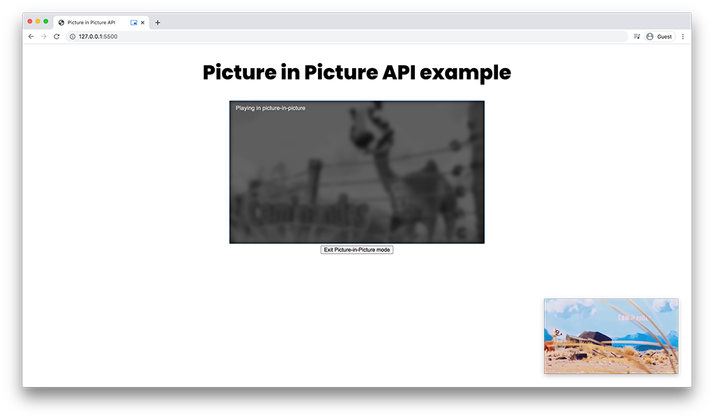
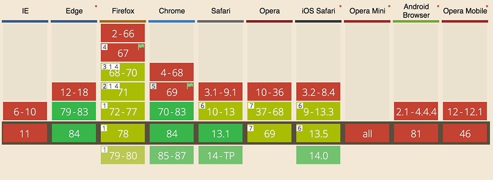

**Picture-in-Picture API** من المزايا الجديدة التي أضيفت لعدد من المتصفحات الحديثة، ودورها تمكين المستخدم من **تعويم** فيديوهات HTML5 في نافذة خاصة أسفل الشاشة مع القدرة على التنقل بين مختلف نوافذ المتـصفح (بل وجميع التطبيقات في الجهاز) والفيديو مشغل.



ويعتبر موقع يوتيوب أبرز من قام بتطبيق هذه الخاصية، إذ يمكن تشغيل فيديو وفي نفس الوقت التنقل بين الصفحات الأخرى وذلك بعد تفعيل وضع Picture-in-Picture المعروف في يوتيوب بالـ Miniplayer، في تجربة تشبه تلك الموجودة في تطبيق الموبايل.

الفرق الوحيد أن يوتيوب قام بتنفيذ هذه الفكرة بطريقته الخاصة بعيدا عن Picture in Picture API، ولذلك فالـ Miniplayer الخاص بيوتيوب لا يوفر كافة المزايا الموجودة في PiP API مثل إمكانية بقاء الفيديو مشغلا مهما انتقلنا بين التطبيقات في الجهاز شريطة ألا نقوم بإغلاق التبويبة حيث صفحة الفيديو.

في هذا الدرس سنتعلم معا كيفية التعامل مع هذه الواجهة البرمجية الجديدة، ولذلك سنقوم بإنشاء صفحة `index.html` بسيطة جدا لا تحتوي إلا على وسم الفيديو وأسفله الزر الذي سيمكننا من تفعيل وضع PiP أو إزالته 😉

```html
<video
  id="video"
  controls
  playsinline
  src="https://storage.googleapis.com/media-session/caminandes/short.mp4"
  poster="https://storage.googleapis.com/media-session/caminandes/artwork-512.png"
></video>

<div>
  <button id="pipButton" disabled>تفعيل وضع Picture-in-Picture</button>
</div>
```

في كود جافا سكريبت سنقوم بإنشاء المتغيرين `video` و `pipButton` اللذان سيسمحان لنا بالوصول إلى الفيديو والزر.

```js
const video = document.getElementById('video');
const pipButton = document.getElementById('pipButton');
```

الخطوة الثاني هي أن نتأكد أولا من أن **Picture in Picture API** مدعومة من المتصفح العميل لأن هذه الميزة كما قلنا **ما تزال جديدة ودعمها محدود** حتى وقت كتابة هذه السطور.

```js{4-6}
const video = document.getElementById('video');
const pipButton = document.getElementById('pipButton');

if ('pictureInPictureEnabled' in document) {
}
```

تلاحظون كذلك في HTML أننا قمنا بتعطيل الزر `#pipButton` عن طريق الخاصية `disabled`، وسنقوم بإزالة تلك الخاصية وتفعيله بواسطة جافا سكريبت فقط في حالة كانت واجهة PiP مدعومة.

```js{5}
const video = document.getElementById('video');
const pipButton = document.getElementById('pipButton');

if ('pictureInPictureEnabled' in document) {
  pipButton.disabled = false;
}
```

بعد ذلك سنطلب من الفيديو `#video` أن يفتح في وضع Picture in Picture عند النقر على الزر `#pipButton`.

```js{7-9}
const video = document.getElementById('video');
const pipButton = document.getElementById('pipButton');

if ('pictureInPictureEnabled' in document) {
  pipButton.disabled = false;

  pipButton.addEventListener('click', function() {
    video.requestPictureInPicture().catch(console.log);
  });
}
```

الوظيفة `requestPictureInPicture()` كما هو واضح تقوم بإرجاع `Promise` ولذلك استعملنا `catch()` للحصول على أي خطأ وضمان استكمال البرنامج بدون مشاكل حتى ولو فشلت.

الآن عندما ننقر على الزر `#pipButton` فإنه الفيديو يفتح في وضع PiP 👍 نريد عندما ننقر **مرة ثانية** على الزر أن نخرج من ذلك الوضع.

```js{8,9}
const video = document.getElementById('video');
const pipButton = document.getElementById('pipButton');

if ('pictureInPictureEnabled' in document) {
  pipButton.disabled = false;

  pipButton.addEventListener('click', function() {
    if (document.pictureInPictureElement) {
      document.exitPictureInPicture().catch(console.log);
    } else {
      video.requestPictureInPicture().catch(console.log);
    }
  });
}
```

بفضل الخاصية `document.pictureInPictureElement` نستطيع التأكيد من أن هناك فيديو مفتوح في وضع PiP بالصفحة أم لا.

## أحداث (Events) متعلقة بوضع Picture-in-Picture

لحد الآن تعمل لدينا ميزة PiP كما يجب، فقط يظل عندنا مشكل صغير يتعلق بالنص الذي يظهر في الزر `#pipButton` أي `تفعيل وضع Picture-in-Picture`.

نريد تغيير الكلمة `تفعيل` إلى `تعطيل` والعكس صحيح كلما تغير وضع PiP.

الطريقة سهلة جدا بفضل الحدثين `enterpictureinpicture` و `leavepictureinpicture`.

```js
video.addEventListener('enterpictureinpicture', () => {
  pipButton.textContent = 'تعطيل وضع Picture-in-Picture';
});

video.addEventListener('leavepictureinpicture', () => {
  pipButton.textContent = 'تفعيل وضع Picture-in-Picture';
});
```

لا داعي لشرح الحدثين، "فالمكتوب باين من عنوانه" كما يقول الإخوة المصريون 😄

**هذه نتيجة كل ما شرحناه في هذا الدرس:**

<iframe
  src="https://codesandbox.io/embed/withered-wind-utsuh?fontsize=14&hidenavigation=1&theme=dark"
  style="width:100%; height:500px; border:0; border-radius: 4px; overflow:hidden;"
  title="withered-wind-utsuh"
  allow="accelerometer; ambient-light-sensor; camera; encrypted-media; geolocation; gyroscope; hid; microphone; midi; payment; usb; vr; xr-spatial-tracking"
  sandbox="allow-forms allow-modals allow-popups allow-presentation allow-same-origin allow-scripts"
></iframe>

## في الختام

ما تزال هذه الميزة في بداياتها ولذلك فإنها غير مدعومة بشكل كافي من كافة المتصفحات والأجهزة الأكثر استخداما.



هذا لا يمنع استخدامها ـ ولكن بحذر ـ لنستفيد من تجربة الإستخدام المميزة التي تمنحها للمواقع الإلكترونية التي تعتمد بالدرجة الأولى على المحتوى المرئي.

<Author slug="aissa" />
