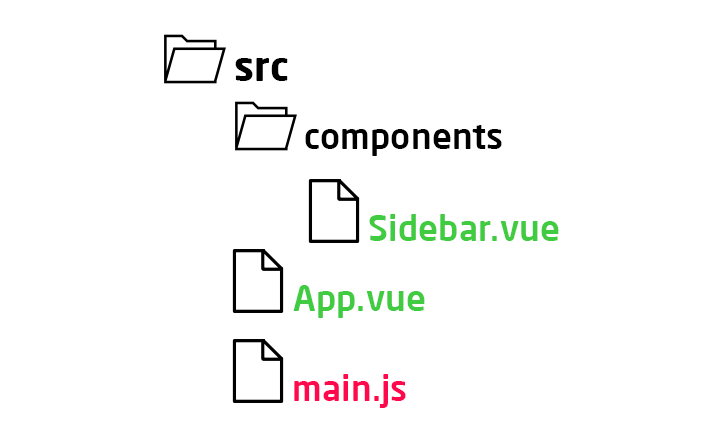
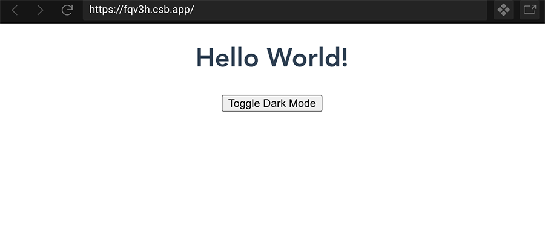
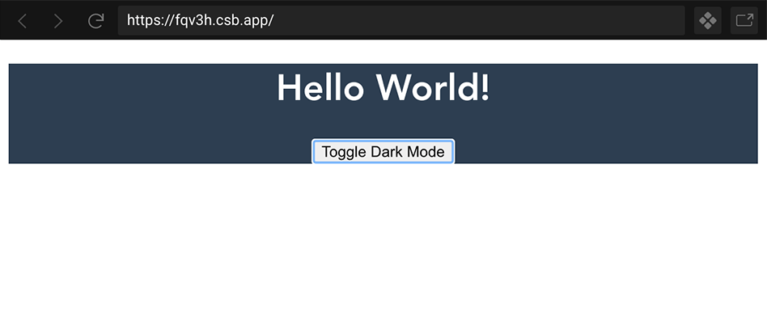

في المدة الأخيرة قمت بتجربة عدد من المزايا الجديد في [Vue.js](/vuejs-framework) وعلى رأسها ميزة **Composition API** المرتقبة في الإصدار Vue 3 الذي ينتظره على أحر من الجمر جميع محبي إطار العمل Vue.

فريق [Vue.js](/vuejs-framework) الرسمي وفروا إضافة (_Plugin_) اسمها `@vue/composition-api` لتمكين المطورين من اكتشاف روعة Composition API والإستعانة بها في مشاريعهم التي يستخدمون فيها الإصدار Vue 2 دون أن يضطروا لإنتظار قدوم Vue 3 الذي ستكون هذه الميزة مدمجة فيه.

يمكن تشبيه Composition API بفكرة ال [Hooks](/web-development/javascript/introduction-react-hooks/) في عالم [React.js](/tags/react/) بحيث تمكننا من استخلاص (Extract) عدد من المهام والعمليات المنطقية إلى دوال خاصة قابلة لإعادة الإستخدام بسهولة، مما يجعل الشفرة المصدرية للمكونات **واضحة**، **أكثر قابلية للقراءة** و**مرتبة بحسب الوظائف** (Organized by feature).

<iframe style="max-width: 100%;margin: 0 auto; padding: 1rem 0 2rem; display: block; box-sizing: content-box;" width="560" height="315" src="https://www.youtube.com/embed/6HUjDKVn0e0?controls=0" frameborder="0" allow="accelerometer; autoplay; encrypted-media; gyroscope; picture-in-picture" allowfullscreen></iframe>

## مثال "الوضع الليلي" لاكتشاف Vue Composition API

لاكتشاف هذه الواجهة البرمجية الجديدة في Vue.js سننجز مثال عملي نرى من خلاله مدى جمالية هذه الميزة الجديدة.

المثال بسيط، ولكن ما يهمنا هو الفكرة 😉

ستكون لدينا صفحة فيها مكونان اثنان:

- المكون الرئيسي `App`.
- مكون ثانٍ اسمه `Sidebar` وبداخله زر عند النقر عليه يتم تفعيل أو إلغاء **الوضع الليلي** أو _Dark mode_ في الصفحة.

في المكون الرئيسي `App` سيتم إضافة الكلاس `dark-mode` إلى العنصر الرئيسي `div#app` إذا كان الوضع الليلي مفعلا ونزيلها إذا تم إلغاؤه.

إلى هنا من المفترض أن يكون شكل مشروعنا على هذا النحو:



<div class="filename">src/App.vue</div>

```html
<template>
  <div id="app">
    <h1>Hello World!</h1>
    <Sidebar />
  </div>
</template>

<script>
  import Sidebar from './components/Sidebar';

  export default {
    name: 'App',
    components: {
      Sidebar,
    },
  };
</script>

<style>
  #app {
    font-family: 'Avenir', Helvetica, Arial, sans-serif;
    text-align: center;
    color: #000;
    margin: 0;
    padding: 0;
  }

  /* الوضع الليلي */
  #app.dark-mode {
    background: #000;
    color: #fff;
  }
</style>
```

<div class="filename">src/components/Sidebar.vue</div>

```html
<template>
  <button>Toggle Dark Mode</button>
</template>

<script>
  export default {
    name: 'Sidebar',
  };
</script>
```

إلى حدود الساعة لا شيء جديد، مجرد مكونات Vue اعتيادية.

ما سنقوم به الآن لكي نتقدم أكثر هو أننا سنقوم بإنشاء مجلد جديد بجانب المجلد `components` وليكن اسمه مثلا `composable`.

البعض الآخر من المطورين قد يسمونه `functions` أو `hooks`، ولكن هذا لا يهم كثيرا بقدر ما يهمنا ما يوجد بداخله 😃

بداخل المجلد `composable` سننشئ ملفا اسمه `useDarkMode.js` وبداخله سنضع كل العمليات المنطقية التي تخص الوضع الليلي في تطبيقنا.

## إضافة `@vue/composition-api`

حان الوقت الآن لنقوم بتثبيت الإضافة `@vue/composition-api` التي حدثتكم عنها في بداية المقالة.

```
npm install @vue/composition-api
```

بعد نجاح التثبيت سنطلب من مكتبة `Vue.js` أن تأخذ بعين الإعتبار هذه الإضافة، تماما كما نفعل مع أي إضافة أخرى ل `Vue.js`.

سنقوم بذلك من خلال الملف الرئيسي `main.js`:

<div class="filename">src/main.js</div>

```js{2,6}
import Vue from 'vue';
import VueCompositionApi from '@vue/composition-api';

import App from './App.vue';

Vue.use(VueCompositionApi);

Vue.config.productionTip = false;

new Vue({
  render: (h) => h(App),
}).$mount('#app');
```

سنعود الآن إلى الملف `useDarkMode.js` ونبدأ في كتابة الكود.

أولا سنقوم بإنشاء الدالة `useDarkMode` وبداخلها متغير متفاعل (Reactive) باستعمال الدالة أو الوظيفة `ref()` التي توفرها لنا Composition API عن طريق الإضافة `@vue/composition-api`.

<div class="filename">src/composable/useDarkMode.js</div>

```js
import { ref } from '@vue/composition-api';

const useDarkMode = () => {
  const isDarkMode = ref(false);
};

export default useDarkMode;
```

`ref` هي دالة تأخذ قيمة داخلية بدئية وتعيد كائن تفاعلي وقابل للتغيير (Mutable). هذا الكائن له خاصية واحدة اسمها `value` ومن خلالها نستطيع الوصول للقيمة الداخلية لهذا الكائن أو تغييرها.

إذن في مثالنا التعبير `isDarkMode.value` يساوي القيمة `false`.

بعد معرفة هذا، سنلجأ الآن لإضافة الدالة التي ستمكننا من تفعيل وإلغاء الوضع الليلي، ولنسميها `toggleDarkMode`.

<div class="filename">src/composable/useDarkMode.js</div>

```js{6-8}
import { ref } from '@vue/composition-api';

const useDarkMode = () => {
  const isDarkMode = ref(false);

  const toggleDarkMode = () => {
    isDarkMode.value = !isDarkMode.value;
  };
};

export default useDarkMode;
```

لكي نتمكن من استخدام الكائن التفاعلي `isDarkMode` والدالة `toggleDarkMode` خارج `useDarkMode` سيكون علينا إرجاعهما بطبيعة الحال 😉

<div class="filename">src/composable/useDarkMode.js</div>

```js{10}
import { ref } from '@vue/composition-api';

const useDarkMode = () => {
  const isDarkMode = ref(false);

  const toggleDarkMode = () => {
    isDarkMode.value = !isDarkMode.value;
  };

  return { isDarkMode, toggleDarkMode };
};

export default useDarkMode;
```

الآن أصبح بإمكاننا استخدام هذه الدالة في جميع مكونات تطبيقنا التي يهمها أمر الوضع الليلي.

لنذهب إلى المكون `App.vue` ولنطلب منه أن يضيف الكلاس `dark-mode` إلى `div#app` إذا كانت قيمة `isDarkMode` تساوي `true`.

علينا أولا استيراد `useDarkMode()` بالشكل الطبيعي الذي ألفناه..

<div class="filename">src/App.vue</div>

```html{10}
<template>
  <div id="app">
    <h1>Hello World!</h1>
    <Sidebar />
  </div>
</template>

<script>
  import Sidebar from './components/Sidebar';
  import useDarkMode from './composable/useDarkMode.js';

  export default {
    name: 'App',
    components: {
      Sidebar,
    },
  };
</script>

<style>
  /* ... */
</style>
```

الوصول للواجهات البرمجية التي توفرها Composition API يتم داخل عضو جديد ضمن الخيارات التي يتوفر عليها مكون [Vue](/vuejs-framework/). هذا الخيار الجديد هو الدالة `setup()` التي تعد بمثابة المدخل أو الممر الأساسي الذي **يجب أن يمر منه أي استخدام ل Composition API**.

جميع القيم والمتغيرات المرجعة من الوظيفة `setup()` تكون متاحة لقالب المكون (_Template_)، تماما مثل الحالات الموجودة داخل الكائن الذي يتم إرجاعه من الوظيفة `data()`.

<div class="filename">src/App.vue</div>

```html{2,17-21}
<template>
  <div id="app" :class="{'dark-mode': isDarkMode}">
    <h1>Hello World!</h1>
    <Sidebar />
  </div>
</template>

<script>
  import Sidebar from './components/Sidebar';
  import useDarkMode from './composable/useDarkMode.js';

  export default {
    name: 'App',
    components: {
      Sidebar,
    },
    setup() {
      const { isDarkMode } = useDarkMode();

      return { isDarkMode };
    },
  };
</script>

<style>
  /* ... */
</style>
```

لاحظوا كيف استطعنا الوصول إلى المتغير المتفاعل `isDarkMode` في قالب المكون، وبواسطته يتم إضافة الكلاس `dark-mode` عبر خاصية Class Binding المعروفة في Vue.js.

القالب أخذ ذلك المتغير من الوظيفة `setup()`، **وكلما طرأ عليه تغيير يتم تحديث القالب**.

سنذهب الآن إلى المكون `Sidebar.vue` حيث سنستعمل الكائن الآخر المرجع من `useDarkMode` وهو الدالة `toggleDarkMode` كما تتذكرون. هذه الأخيرة ستمكننا من التلاعب بقيمة الوضع الليلي عند النقر على الزر الموجود في المكون `Sidebar`.

<div class="filename">src/components/Sidebar.vue</div>

```html{2,6,10-13}
<template>
  <button @click="toggleDarkMode">Toggle Dark Mode</button>
</template>

<script>
  import useDarkMode from '../composable/useDarkMode.js';

  export default {
    name: 'Sidebar',
    setup() {
      const { toggleDarkMode } = useDarkMode();
      return { toggleDarkMode };
    },
  };
</script>
```

## انتهينا ؟

الآن من المفترض أنه عند النقر على الزر `Toggle Dark Mode` فإنه ستصبح قيمة `isDarkMode` هي `true` وبالتالي يضاف الكلاس `dark-mode` إلى `div#app` فيصبح لون الخلفية أسود والخطوط بيضاء اللون.

ولكن لا شيء من ذلك يحدث 💣 😱



لا يحدث شيء عند النقر، **لماذا ؟!!**

## ما الحل ؟

السبب ببساطة أنه عندما استعننا بالدالة `useDarkMode()` في المكونين `App` و `Sidebar` قد تم استدعاؤها مرتين وبالتالي تم إنشاء نسختين **لا علاقة بينهما** من المتغير المتفاعل `isDarkMode`.

عندما ننقر على الزر `Toggle Dark Mode` فإنه يتم تغيير قيمة `isDarkMode` الذي أرجعته الدالة المستدعاة في `Sidebar.vue` وليس ذلك الذي استعملناه في المكون `App.vue`.

هذا الأمر طبيعي في جافا سكريبت ومتوقع حدوثه. فالدالة `useDarkMode` تمكننا لحد الساعة من **إعادة استخدام** منطق الوضع الليلي، وليس **مشاركة الحالة** بين مكونات التطبيق.

**هناك فرق كبير بين المشاركة (Share) وإعادة الإستخدام (Reuse)** 👍

في Vue.js يمكن إيجاد حل لهذا المشكل إما بالحصول على الدالة `useDarkMode` في المكون `App.vue` وتمريرها ك Prop إلى المكون `Sidebar` من أجل استخدامها، وبالتالي هنا يتشاركان نفس الكائن التفاعلي `isDarkMode`.

يمكن كذلك اللجوء لخيار [Provide/Inject](https://v3.vuejs.org/guide/component-provide-inject.html) الذي يحاكي إلى حد بعيد فكرة Context API في مكتبة React.js، ولكن لا داعي لذلك فالمسألة بسيطة في مثالنا.

الحل الثالث، الذي أفضله في هذه الحالة، بسيط للغاية 😎 فقط نقوم **بإخراج** المتغير المتفاعل `isDarkMode` من الدالة `useDarkMode`. هكذا سيكون لدينا **متغير واحد مشترك** بين جميع المكونات التي تستخدم هذه الدالة.

```js{3}
import { ref } from '@vue/composition-api';

const isDarkMode = ref(false);

const useDarkMode = () => {
  const toggleDarkMode = () => {
    isDarkMode.value = !isDarkMode.value;
  };

  return { isDarkMode, toggleDarkMode };
};

export default useDarkMode;
```

بهكذا طريقة سيكون لدينا `isDarkMode` واحد في كل التطبيق، تتشاركه كافة المكونات التي تستعين بالدالة `useDarkMode`.

إلى هنا، ظننت في خلال تعلمي وتجربتي لميزة Composition API أن الأمور ستسير على ما هو متوقع منها الآن. ولكن **هيهات**!! 💣 💣

لقد خرج إلي مشكل آخر لم يكن بالحسبان، واستغرقت أزيد من **أربع ساعات** لأجد الحل.


الرسالة واضحة تقول بأنه علينا عمل `Vue.use(VueCompositionApi)` مرة ثانية بعدما عملناها في ملف `main.js`، وهو الأمر الذي لم أستوعبه ولم يبدُ لي منطقيا.

بعد ساعات من البحث في جوجل وعلى اليوتيوب توصلت إلى أن سبب هذا المشكل متعلق بالإضافة `@vue/composition-api`، وأن هذا الخطأ لن يظهر في الإصدار Vue 3 الذي ستدمج فيه الواجهات البرمجية ل Composition API.

بعد ذلك طاوعتني نفسي لحل المسألة عن طريق `Vue.use(...)` بعد أن فهمت أصل الحكاية 😅

```js{2,4}
import Vue from 'vue';
import VueCompositionApi, { ref } from '@vue/composition-api';

Vue.use(VueCompositionApi);

const isDarkMode = ref(false);

const useDarkMode = () => {
  const toggleDarkMode = () => {
    isDarkMode.value = !isDarkMode.value;
  };
  return {
    isDarkMode,
    toggleDarkMode,
  };
};

export default useDarkMode;
```

بعد كل هذا، أصبح الآن الوضع الليلي في تطبيقنا يعمل بشكل جيد وأصبحت الحالة `isDarkMode` **قابلة للمشاركة** في جميع أنحاء التطبيق.



يمكنكم **معاينة النتيجة النهائية** مع الشفرة المصدرية في _Codesandbox.io_ من خلال الزر أسفله:

<a href="https://codesandbox.io/s/vue-share-state-fqv3h?fontsize=14&hidenavigation=1&theme=dark" target="_blank" title="معاينة النتيجة في codesandbox.io">
  
</a>

### إضافة

لاحظتم أنه، وكما شرحت، كان لزاما علي استعمال الوظيفة `setup()` للوصول إلى أي من الواجهات البرمجة التي توفرها Composition API. ورأيتم أننا استخلصنا منطق الوضع الليلي إلى دالة خاصة قابلة لإعادة الإستخدام.

هذا الإستخلاص **ليس ضروريا**.

في كثير من الأحيان لا بأس في التعامل مع Composition API مباشرة داخل `setup()` دون المرور عبر أي Composable function مثل `useDarkMode` في حالتنا.

```html
<template>
  <div>{{ count }}</div>
  <button @click="increment"></button>
</template>

<script>
  import { ref } from '@vue/composition-api';

  export default {
    setup() {
      const count = ref(0);

      const increment = () => count.value++;

      return {
        count,
        increment,
      };
    },
  };
</script>
```

هذا كله عائد إلى طبيعة المشروع وإذا ما كانت تلك المهام داخل `setup()` سنحتاج إليها أو يعاد استخدامها في أكثر من مكان أم لا.

على كل حال يمكن الرجوع إلى [التوثيق الرسمي](https://composition-api.vuejs.org/) للمزيد من المعلومات والتفاصيل، وهي في الحقيقة كثيرة فهدفنا من هذا الدرس كان اكتشاف فكرة Composition API وماذا يمكننا عمله بواسطتها.

## في الختام

أتمنى أن يكون الدرس واضحا لك، وإذا كانت لديك صديقي أية أسئلة أو استفهامات فلا تتردد في طرحها علي من خلال صندوق التعليقات.

أراك في درس قادم ✋

<Author slug="aissa" />
